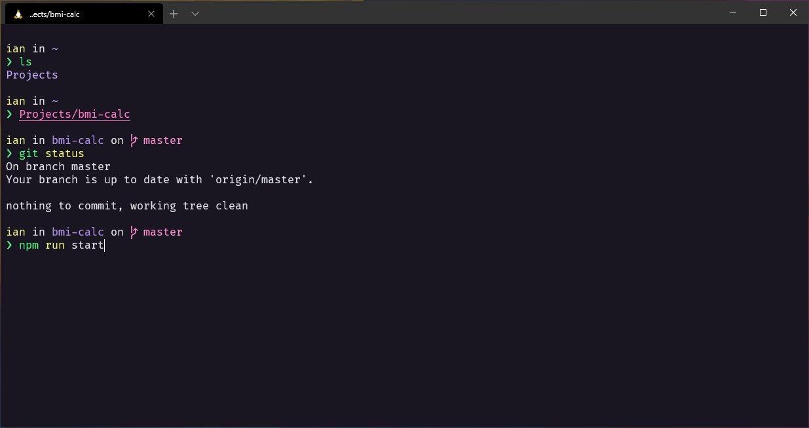

# Omni for [Windows Terminal](https://github.com/microsoft/terminal)

> Based on [Omni for Hyper](https://github.com/Rocketseat/hyper-omni/) by [Rocketseat](https://github.com/Rocketseat/)



## Download

Download using the [GitHub .zip download](https://github.com/ianfilipe/windows-terminal-omni/archive/master.zip) option

## Install

Start Windows Terminal and click on the down arrow symbol `˅` from menu bar. This will open a drop down menu from which select Settings option. Alternatively use `Ctrl +` , to open Settings directly.

In the `profile.json` settings file for Windows Terminal, find the `schemes` section and paste the content of `omni.json`.

Example:

```json
"schemes": [
  {
    "name" : "Omni",
    "background" : "#191622",
    "black" : "#000000",
    "blue" : "#bd93f9",
    "brightBlack" : "#4d4d4d",
    "brightBlue" : "#caa9fa",
    "brightCyan" : "#aa91e3",
    "brightGreen" : "#5af78e",
    "brightPurple" : "#ff92d0",
    "brightRed" : "#ff6e67",
    "brightWhite" : "#e6e6e6",
    "brightYellow" : "#eaf08d",
    "cyan" : "#8d79ba",
    "foreground" : "#E1E1E6",
    "green" : "#50fa7b",
    "purple" : "#ff79c6",
    "red" : "#ff5555",
    "white" : "#bfbfbf",
    "yellow" : "#effa78"
  }
]
```

## Activate

Once the color scheme has been defined, it's time to enable it. Find the `profiles` section and add a `colorScheme` value to the default profile.

Example:

```json
"profiles": {
  "defaults": {
    "colorScheme" : "Omni"
  }
}
```

## Tips

The screenshot shown is a combination of Zsh, Oh My Zsh, Themes, Plugins and more... Follow [this guide](https://gist.github.com/ianfilipe/135670ac1d4cbea01984f48b6c0bc97b) to get the same appearance.

